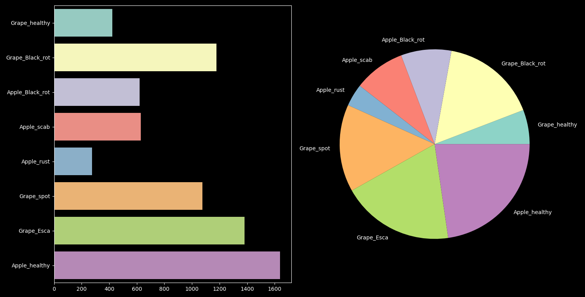

# 42 Deep Learning Computer vision project: Leaffliction

This is a solo rework on a group project. The old version can be found <a href="https://github.com/thervieu/leaffliction">on the old github repository</a>.

Why the rework ? Here are a few reasons:
- A lot of improvements could be made to the code
- I wanted to integrate a **fastAPI** interface to the project, which was not part of the assignment
- Updates to **plantCV** made the library better, but those same updates completely broke our own implementation
- We successfully finished the project by training **6 different models per plant type** (one per transformation)
and using a **voting system** to decide on the classification results. I wanted to know if
training a **single model** on the whole dataset (the original images from both plant types AND
the transformed ones together) could yield better results

## Overview

The goal of the project is to use various tools to **analyse**, **augment**, and **classify** a
dataset comprised of **plant leaf images**, using deep learning and computer vision techniques.

The neural network model we chose to use was a **Convolutional Neural Network (CNN)**.

The project's dataset is a subset from <a href="https://www.kaggle.com/datasets/emmarex/plantdisease">Kaggle's PlantVillage dataset</a>,
using only the *Apples* and *Grapes* disease data.

### Rework structure

For the rework, I separated the "legacy" code which is still present in the files beginning with `cli*`
from the "new" code in the `web*` files.

The two main differences are:
- The *web* files have less console output, since there will be a fastAPI interface
- The *web* files will interact with the whole dataset without separating the plant types or the
transformations, and yield a single model that will be used for the web predictions

## Libraries used

* The whole project was coded using python 3.11
* **matplotlib** and **seaborn** (*data visualisation*)
* **numpy** (*data structure*)
* **opencv** (*computer vision library*)
* **plantcv** (*plant-specialised computer vision library, based on OpenCV*)
* **tensorflow** and **keras** (*deep learning models*)
* **click** (*program argument parser*)
* **pillow** (*image manipulation*)

## Quickstart

The data can be found inside the `/static/resources/images` folder. Technically, the programs should work with
the entire original kaggle dataset if you want to download it from there instead.

As the **cli** was part of the original group project, this quickstart will only focus on the **web** part. Here
is a walkthrough on what would be a standard workflow.

-----------------------

First, we must pre-process the data. Three python programs interact with the data before the training process:

### data_distribution.py

This program aims to output a plot of a dataset's class distribution.

```sh
$> python data_distribution.py --dataset static/resources/images
```

The previous code will produce this plot:



As you can see, the dataset is quite imbalanced, which brings us to the next step.

### data_augmentation.py

This program's aim is to randomly apply **image augmentation** to classes that lack data compared to others. Those are basic augmentation techniques, like flipping, and random rotations or projections.

Running the following code should create a much more balanced dataset.

```sh
$> cp -r static/resources/images dataset
$> python data_augmentation.py --src dataset
```

The program also works on single files, applying the preset augmentations *only* to that file, by using the `--file` parameter instead.

### web_transform.py

Further image transformation is possible with the **plantCV** library, to augment the dataset even more. The library puts at our disposal functions to extract valuable information from plant images, like landmarks, or easy masking of the images' background.

```sh
$> python web_transform.py --src dataset --dst dataset_transformed
```

This would create a new folder called `dataset_transformed`, its name is self-explanatory.

-----------------------

After the data processing, a model can finally be trained.

### web_train.py

This is the main training program. It reuses much of the code from the previous cli version to train a **CNN**, but the **big change** is that it only trains a single model, on the whole transformed dataset, instead of one model per transformation.

```sh
$> python web_train --data dataset_transformed
```

This will train a model on the transformed dataset, and save the model to a file called `leaffliction.joblib`. This is a default behaviour, and you can change the path with the `--model_path` argument.

### web_start.py

Finally, this is the program that launches the fastAPI interface, accessible on `localhost:8000`
